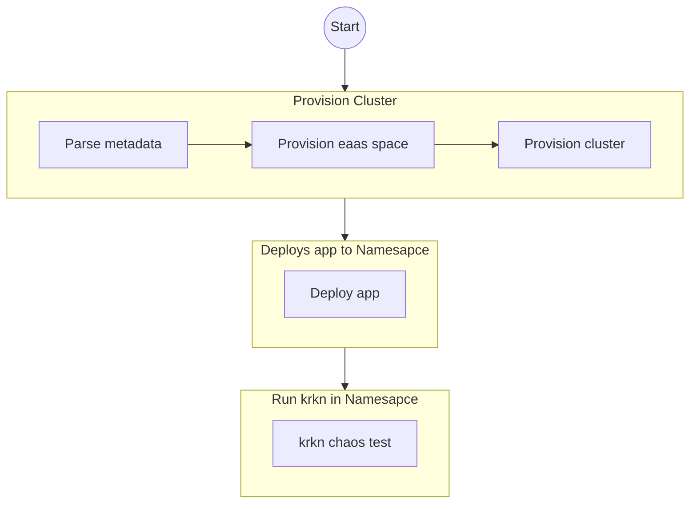
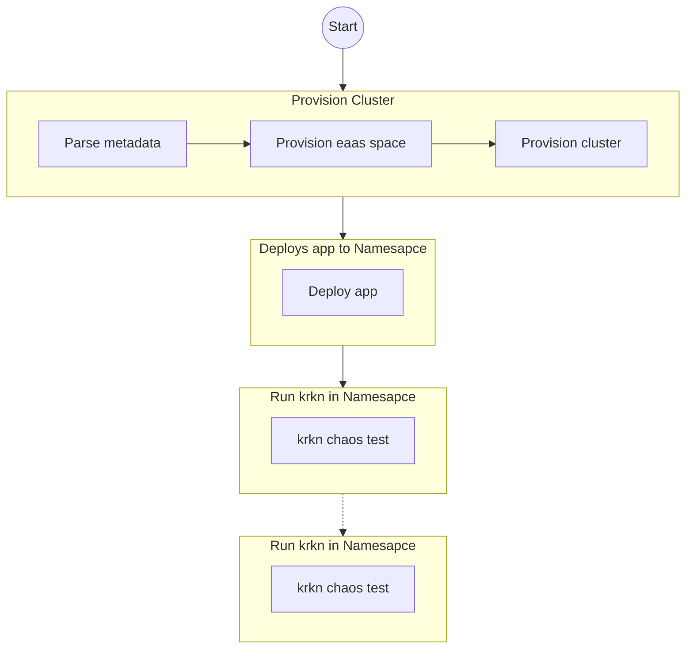
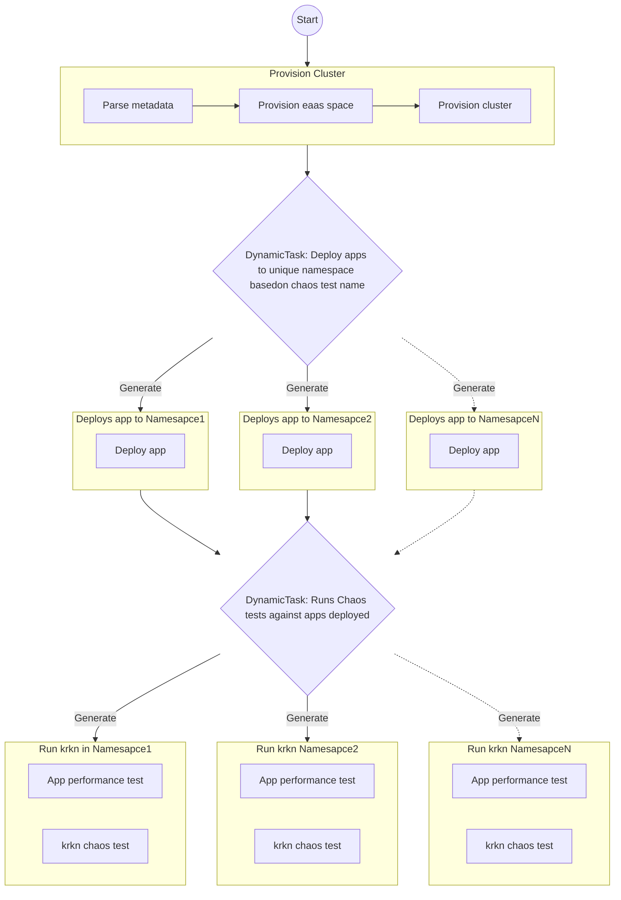

# konflux-chaos
Running Chaos Tests with Konflux

## Overview

This project enables running chaos tests as part of the Konflux integration pipeline.  This process typically involves three key steps:

- **Cluster Provisioning**: 
For provisioning an OpenShift cluster, we reuse tasks provided by the Konflux project. These tasks handle the setup of the cluster seamlessly.
- **Application Deployment**: 
After provisioning the cluster, users need to deploy their application.
You can customize the application deployment template [stepactions/step-deploy-app.yaml](stepactions/step-deploy-app.yaml) to match your application's requirements. This modified template is used in the application provisioning task [task/task-run-app.yaml](task/task-run-app.yaml).
- **Chaos Test Execution**: 
Once the application is deployed, you can run Krkn Chaos tests.

 #### **Example Template**
[trex-chaos-test.yaml](trex-chaos-test.yaml)

### Sequential Execution: 
Run chaos tests one after another.

### Parallel Execution: Execute chaos tests concurrently.
Refer to the sample template [trex-chaos-perf-test.yaml](trex-chaos-perf-test.yaml) to see how to run load tests (performance tests) alongside Krkn chaos tests in parallel.

## Customizing Krkn Behavior

Krkn's [stepactions](stepactions/step-deploy-krkn.yaml)  provide a flexible framework for tailoring chaos engineering experiments. You can customize the following aspects:

- **Test Name**: Specify the desired Krkn test to use.
- **Kubeconfig**: Specify Kubernetes configuration to use.
- **Namespace**: Ensure the target application is deployed to the same namespace as the Krkn test.
- **Test Variables**: Configure necessary variables within the stepaction script or via environment variables.
## Tips:

- **Template Customization**: Adapt the [step-deploy-app.yaml](stepactions/step-deploy-app.yaml) template to align with your application's deployment process.
- **Parallel Execution**: Leverage the [trex-chaos-perf-test.yaml](rex-chaos-perf-test.yaml) template to execute multiple tests simultaneously.

- **Krkn Stepaction Flexibility**: Customize [stepactions](stepactions/step-deploy-krkn.yaml) to fine-tune chaos engineering experiments based on specific use cases.
By following these guidelines, you can effectively integrate chaos engineering into your KInflux workflows, enhancing the reliability and resilience of your applications.

## Adding Krkn Chaos integration test to Konflux
### Set secrets required by application
Create secrets for the OCM authentication model used by the sample applicaton [rh-trex](https://github.com/openshift-online/rh-trex). Secrets can be created while creating a new application or new secrets can be added to existing components from the secrets tab.
Assign secret and add key/value pairs related to ocm  client id, secret and token.  The service account for ocm can be created at console.redhat.com 

- client_id
- client_secret
- ocmtoken

### Add Integration tests (chaos tests)
Select the component and integration test tab to add a new integration test.
assign appropriate values for "GitHub URL" and  "Path in repository" and Environment as “development”, to run integration tests in ephemeral environment.

- Git repo: https://github.com/krkn-chaos/konflux-chaos.git
- Path: trex-chaos-test.yaml

Go to Applications > Application Name  > Integration Tests 
Click on the “Add Integration Test” button to add a new test.

###  Trigger Chaos test
Trigger a build to verify the configuration
In the “Components” tab, select "Start new build" to trigger a new build.
Or create a new PR in the repo to trigger a new build.

### View results 
Krkn Chaos test results can be viewed from the pipeline logs.

